# Entity Relationship Diagram (ERD) Specification — Personal Portfolio & CMS

**Versi:** 1.0  
**Status:** Draft Final  
**Database Engine:** MySQL 8.x  
**Tanggal:** 6 Agustus 2026  

---

## 1. Overview & Diagram Arsitektur Data

Dokumen ini mendefinisikan rancangan basis data relasional untuk sistem **Personal Portfolio & CMS v1.0** berdasarkan spesifikasi **PRD** dan **SRS**. 

Sistem dirancang secara dinamis di mana:
* Administrator mengelola profil, proyek, publikasi, pengalaman, keahlian, prestasi, sertifikat, tautan sosial, dan pengaturan website.
* Pengunjung publik dapat membaca konten yang dipublikasikan dan mengirimkan pesan kontak.

---

## 2. Mermaid ERD Diagram

```mermaid
erDiagram
    users ||--o| profiles : "1:1 (owns)"
    skill_categories ||--o{ skills : "1:N (categorizes)"
    projects ||--o{ project_images : "1:N (has_gallery)"
    projects ||--o{ project_technologies : "1:N (uses_tech)"
    technologies ||--o{ project_technologies : "1:N (used_in_project)"

    users {
        BIGINT id PK
        VARCHAR email UK
        VARCHAR hashed_password
        TIMESTAMP created_at
        TIMESTAMP updated_at
    }

    profiles {
        BIGINT id PK
        BIGINT user_id FK, UK
        VARCHAR full_name
        VARCHAR headline
        TEXT bio
        TEXT education
        VARCHAR career_focus
        TEXT research_interests
        VARCHAR avatar_url
        VARCHAR cv_url
        TIMESTAMP updated_at
    }

    skill_categories {
        BIGINT id PK
        VARCHAR name UK
        INT order_index
        TIMESTAMP created_at
        TIMESTAMP updated_at
    }

    skills {
        BIGINT id PK
        BIGINT category_id FK
        VARCHAR name
        VARCHAR level
        VARCHAR icon_name
        INT order_index
        TIMESTAMP created_at
        TIMESTAMP updated_at
    }

    projects {
        BIGINT id PK
        VARCHAR title
        VARCHAR slug UK
        TEXT summary
        LONGTEXT description
        TEXT background
        TEXT problem
        TEXT solution
        LONGTEXT implementation
        TEXT results
        SMALLINT year
        ENUM status
        BOOLEAN is_featured
        VARCHAR github_url
        VARCHAR demo_url
        VARCHAR thumbnail_url
        TIMESTAMP created_at
        TIMESTAMP updated_at
    }

    technologies {
        BIGINT id PK
        VARCHAR name UK
        VARCHAR icon_name
        TIMESTAMP created_at
    }

    project_technologies {
        BIGINT project_id PK, FK
        BIGINT technology_id PK, FK
    }

    project_images {
        BIGINT id PK
        BIGINT project_id FK
        VARCHAR image_url
        VARCHAR caption
        INT order_index
        TIMESTAMP created_at
    }

    experiences {
        BIGINT id PK
        VARCHAR title
        VARCHAR company_organization
        VARCHAR location
        ENUM category
        DATE start_date
        DATE end_date
        BOOLEAN is_current
        TEXT description
        INT order_index
        TIMESTAMP created_at
        TIMESTAMP updated_at
    }

    publications {
        BIGINT id PK
        VARCHAR title
        TEXT authors
        VARCHAR publisher_venue
        SMALLINT year
        TEXT abstract
        VARCHAR doi
        VARCHAR publication_url
        VARCHAR pdf_url
        TIMESTAMP created_at
        TIMESTAMP updated_at
    }

    achievements {
        BIGINT id PK
        VARCHAR title
        ENUM category
        VARCHAR issuer
        DATE year_date
        TEXT description
        VARCHAR credential_url
        TIMESTAMP created_at
        TIMESTAMP updated_at
    }

    certificates {
        BIGINT id PK
        VARCHAR name
        VARCHAR issuer
        DATE issue_date
        DATE expiry_date
        VARCHAR credential_id
        VARCHAR credential_url
        VARCHAR image_url
        TIMESTAMP created_at
        TIMESTAMP updated_at
    }

    messages {
        BIGINT id PK
        VARCHAR sender_name
        VARCHAR sender_email
        VARCHAR subject
        TEXT message
        BOOLEAN is_read
        TIMESTAMP created_at
    }

    social_links {
        BIGINT id PK
        VARCHAR platform_name
        VARCHAR url
        VARCHAR icon_name
        INT order_index
        BOOLEAN is_active
        TIMESTAMP created_at
        TIMESTAMP updated_at
    }

    settings {
        BIGINT id PK
        VARCHAR key UK
        TEXT value
        VARCHAR description
        TIMESTAMP updated_at
    }
```

---

## 3. Kamus Data & Spesifikasi Tabel (MySQL 8.x)

### 3.1 Tabel `users`
Menyimpan akun administrator untuk autentikasi CMS.

| Field | Data Type | Attributes | Constraint / Description |
| :--- | :--- | :--- | :--- |
| `id` | BIGINT UNSIGNED | AUTO_INCREMENT, PRIMARY KEY | Unique ID pengguna |
| `email` | VARCHAR(255) | NOT NULL, UNIQUE | Email login admin |
| `hashed_password` | VARCHAR(255) | NOT NULL | Password terenkripsi (Bcrypt/Argon2) |
| `created_at` | TIMESTAMP | DEFAULT CURRENT_TIMESTAMP | Waktu pendaftaran/pembuatan |
| `updated_at` | TIMESTAMP | DEFAULT CURRENT_TIMESTAMP ON UPDATE CURRENT_TIMESTAMP | Waktu pembaruan terakhir |

* **Index:** `idx_users_email` ON (`email`)

---

### 3.2 Tabel `profiles`
Menyimpan informasi biodata detail pemilik portofolio (Relasi 1:1 dengan `users`).

| Field | Data Type | Attributes | Constraint / Description |
| :--- | :--- | :--- | :--- |
| `id` | BIGINT UNSIGNED | AUTO_INCREMENT, PRIMARY KEY | Unique ID profil |
| `user_id` | BIGINT UNSIGNED | NOT NULL, UNIQUE, FK | FK ke `users.id` (ON DELETE CASCADE) |
| `full_name` | VARCHAR(255) | NOT NULL | Nama lengkap |
| `headline` | VARCHAR(255) | NULL | Gelar / Tagline profesional |
| `bio` | TEXT | NULL | Deskripsi ringkas / ringkasan biografi |
| `education` | TEXT | NULL | Catatan riwayat pendidikan |
| `career_focus` | VARCHAR(255) | NULL | Fokus karier saat ini |
| `research_interests` | TEXT | NULL | Minat bidang penelitian/riset |
| `avatar_url` | VARCHAR(512) | NULL | URL foto profil |
| `cv_url` | VARCHAR(512) | NULL | URL berkas PDF CV digital |
| `updated_at` | TIMESTAMP | DEFAULT CURRENT_TIMESTAMP ON UPDATE CURRENT_TIMESTAMP | Waktu pembaruan profil |

---

### 3.3 Tabel `skill_categories`
Kategori pengelompokan keahlian (misal: Programming, Frontend, Backend, AI/ML, Cloud).

| Field | Data Type | Attributes | Constraint / Description |
| :--- | :--- | :--- | :--- |
| `id` | BIGINT UNSIGNED | AUTO_INCREMENT, PRIMARY KEY | Unique ID kategori skill |
| `name` | VARCHAR(100) | NOT NULL, UNIQUE | Nama kategori |
| `order_index` | INT | DEFAULT 0 | Urutan tampilan di UI |
| `created_at` | TIMESTAMP | DEFAULT CURRENT_TIMESTAMP | Waktu pembuatan |
| `updated_at` | TIMESTAMP | DEFAULT CURRENT_TIMESTAMP ON UPDATE CURRENT_TIMESTAMP | Waktu pembaruan |

---

### 3.4 Tabel `skills`
Data detail item keahlian teknis maupun non-teknis.

| Field | Data Type | Attributes | Constraint / Description |
| :--- | :--- | :--- | :--- |
| `id` | BIGINT UNSIGNED | AUTO_INCREMENT, PRIMARY KEY | Unique ID skill |
| `category_id` | BIGINT UNSIGNED | NOT NULL, FK | FK ke `skill_categories.id` (ON DELETE CASCADE) |
| `name` | VARCHAR(100) | NOT NULL | Nama keahlian (misal: Python, Next.js) |
| `level` | VARCHAR(50) | NULL | Tingkat kemahiran (misal: Advanced, Expert) |
| `icon_name` | VARCHAR(100) | NULL | Nama ikon Lucide/React-Icons |
| `order_index` | INT | DEFAULT 0 | Urutan tampilan dalam kategori |
| `created_at` | TIMESTAMP | DEFAULT CURRENT_TIMESTAMP | Waktu pembuatan |
| `updated_at` | TIMESTAMP | DEFAULT CURRENT_TIMESTAMP ON UPDATE CURRENT_TIMESTAMP | Waktu pembaruan |

* **Index:** `idx_skills_category` ON (`category_id`)

---

### 3.5 Tabel `projects`
Pusat penyimpanan karya dan proyek portofolio.

| Field | Data Type | Attributes | Constraint / Description |
| :--- | :--- | :--- | :--- |
| `id` | BIGINT UNSIGNED | AUTO_INCREMENT, PRIMARY KEY | Unique ID proyek |
| `title` | VARCHAR(255) | NOT NULL | Judul proyek |
| `slug` | VARCHAR(255) | NOT NULL, UNIQUE | Slug URL ramah SEO (misal: `solarvision`) |
| `summary` | TEXT | NOT NULL | Ringkasan singkat proyek |
| `description` | LONGTEXT | NULL | Deskripsi naratif lengkap |
| `background` | TEXT | NULL | Latar belakang proyek |
| `problem` | TEXT | NULL | Masalah yang dipecahkan |
| `solution` | TEXT | NULL | Solusi yang diterapkan |
| `implementation` | LONGTEXT | NULL | Detail teknis & arsitektur |
| `results` | TEXT | NULL | Hasil, dampak, atau metrik utama |
| `year` | SMALLINT UNSIGNED | NOT NULL | Tahun pengerjaan proyek |
| `status` | ENUM('draft', 'published', 'archived') | DEFAULT 'draft' | Status publikasi |
| `is_featured` | BOOLEAN | DEFAULT FALSE | Apakah ditampilkan di Homepage? |
| `github_url` | VARCHAR(512) | NULL | Tautan ke repositori GitHub |
| `demo_url` | VARCHAR(512) | NULL | Tautan ke Live Demo / Deployment |
| `thumbnail_url` | VARCHAR(512) | NULL | URL gambar sampul proyek |
| `created_at` | TIMESTAMP | DEFAULT CURRENT_TIMESTAMP | Waktu pendaftaran |
| `updated_at` | TIMESTAMP | DEFAULT CURRENT_TIMESTAMP ON UPDATE CURRENT_TIMESTAMP | Waktu pembaruan |

* **Indexes:**
  * `idx_projects_slug` ON (`slug`)
  * `idx_projects_status_featured` ON (`status`, `is_featured`)

---

### 3.6 Tabel `technologies`
Master data teknologi/stack yang digunakan.

| Field | Data Type | Attributes | Constraint / Description |
| :--- | :--- | :--- | :--- |
| `id` | BIGINT UNSIGNED | AUTO_INCREMENT, PRIMARY KEY | Unique ID teknologi |
| `name` | VARCHAR(100) | NOT NULL, UNIQUE | Nama teknologi (misal: FastAPI, Docker) |
| `icon_name` | VARCHAR(100) | NULL | Identifier ikon UI |
| `created_at` | TIMESTAMP | DEFAULT CURRENT_TIMESTAMP | Waktu pendaftaran |

---

### 3.7 Tabel Junction `project_technologies`
Relasi Many-to-Many antara `projects` dan `technologies`.

| Field | Data Type | Attributes | Constraint / Description |
| :--- | :--- | :--- | :--- |
| `project_id` | BIGINT UNSIGNED | NOT NULL, FK | FK ke `projects.id` (ON DELETE CASCADE) |
| `technology_id` | BIGINT UNSIGNED | NOT NULL, FK | FK ke `technologies.id` (ON DELETE CASCADE) |

* **Primary Key:** `PRIMARY KEY (project_id, technology_id)`

---

### 3.8 Tabel `project_images`
Galeri tangkapan layar / ilustrasi proyek (Relasi 1:N dari `projects`).

| Field | Data Type | Attributes | Constraint / Description |
| :--- | :--- | :--- | :--- |
| `id` | BIGINT UNSIGNED | AUTO_INCREMENT, PRIMARY KEY | Unique ID foto galeri |
| `project_id` | BIGINT UNSIGNED | NOT NULL, FK | FK ke `projects.id` (ON DELETE CASCADE) |
| `image_url` | VARCHAR(512) | NOT NULL | URL berkas gambar |
| `caption` | VARCHAR(255) | NULL | Keterangan gambar |
| `order_index` | INT | DEFAULT 0 | Urutan tampilan gambar di galeri |
| `created_at` | TIMESTAMP | DEFAULT CURRENT_TIMESTAMP | Waktu pengunggahan |

* **Index:** `idx_project_images_project` ON (`project_id`)

---

### 3.9 Tabel `experiences`
Timeline rekam jejak kerja, magang, riset, dan organisasi.

| Field | Data Type | Attributes | Constraint / Description |
| :--- | :--- | :--- | :--- |
| `id` | BIGINT UNSIGNED | AUTO_INCREMENT, PRIMARY KEY | Unique ID pengalaman |
| `title` | VARCHAR(255) | NOT NULL | Posisi / Peran (misal: Backend Engineer) |
| `company_organization` | VARCHAR(255) | NOT NULL | Nama Perusahaan / Perguruan Tinggi / Organisasi |
| `location` | VARCHAR(255) | NULL | Lokasi (misal: Jakarta, Indonesia / Remote) |
| `category` | ENUM('work', 'internship', 'freelance', 'research', 'organization', 'other') | NOT NULL | Jenis kategori pengalaman |
| `start_date` | DATE | NOT NULL | Tanggal mulai |
| `end_date` | DATE | NULL | Tanggal selesai (NULL jika masih berjalan) |
| `is_current` | BOOLEAN | DEFAULT FALSE | `true` jika saat ini masih aktif |
| `description` | TEXT | NULL | Rincian tugas dan pencapaian |
| `order_index` | INT | DEFAULT 0 | Urutan tampilan |
| `created_at` | TIMESTAMP | DEFAULT CURRENT_TIMESTAMP | Waktu pembuatan |
| `updated_at` | TIMESTAMP | DEFAULT CURRENT_TIMESTAMP ON UPDATE CURRENT_TIMESTAMP | Waktu pembaruan |

---

### 3.10 Tabel `publications`
Dokumentasi karya ilmiah, jurnal, dan makalah konferensi.

| Field | Data Type | Attributes | Constraint / Description |
| :--- | :--- | :--- | :--- |
| `id` | BIGINT UNSIGNED | AUTO_INCREMENT, PRIMARY KEY | Unique ID publikasi |
| `title` | VARCHAR(500) | NOT NULL | Judul karya ilmiah |
| `authors` | TEXT | NOT NULL | Daftar penulis (misal: "A. User, B. Co-author") |
| `publisher_venue` | VARCHAR(255) | NOT NULL | Jurnal / Konferensi / Penerbit |
| `year` | SMALLINT UNSIGNED | NOT NULL | Tahun publikasi |
| `abstract` | TEXT | NULL | Ringkasan abstrak |
| `doi` | VARCHAR(255) | NULL | Digital Object Identifier |
| `publication_url` | VARCHAR(512) | NULL | Tautan ke halaman publikasi |
| `pdf_url` | VARCHAR(512) | NULL | Tautan ke berkas PDF lengkap |
| `created_at` | TIMESTAMP | DEFAULT CURRENT_TIMESTAMP | Waktu pembuatan |
| `updated_at` | TIMESTAMP | DEFAULT CURRENT_TIMESTAMP ON UPDATE CURRENT_TIMESTAMP | Waktu pembaruan |

---

### 3.11 Tabel `achievements`
Pencapaian, kejuaraan, dan penghargaan.

| Field | Data Type | Attributes | Constraint / Description |
| :--- | :--- | :--- | :--- |
| `id` | BIGINT UNSIGNED | AUTO_INCREMENT, PRIMARY KEY | Unique ID penghargaan |
| `title` | VARCHAR(255) | NOT NULL | Nama penghargaan / kejuaraan |
| `category` | ENUM('competition', 'scholarship', 'academic', 'professional', 'recognition') | NOT NULL | Kategori prestasi |
| `issuer` | VARCHAR(255) | NOT NULL | Pihak pemberi / penyelenggara |
| `year_date` | DATE | NOT NULL | Tanggal / Tahun penerimaan |
| `description` | TEXT | NULL | Penjelasan ringkas |
| `credential_url` | VARCHAR(512) | NULL | Tautan bukti / verifikasi resmi |
| `created_at` | TIMESTAMP | DEFAULT CURRENT_TIMESTAMP | Waktu pembuatan |
| `updated_at` | TIMESTAMP | DEFAULT CURRENT_TIMESTAMP ON UPDATE CURRENT_TIMESTAMP | Waktu pembaruan |

---

### 3.12 Tabel `certificates`
Sertifikasi kompetensi dan lisensi profesional.

| Field | Data Type | Attributes | Constraint / Description |
| :--- | :--- | :--- | :--- |
| `id` | BIGINT UNSIGNED | AUTO_INCREMENT, PRIMARY KEY | Unique ID sertifikat |
| `name` | VARCHAR(255) | NOT NULL | Nama sertifikasi |
| `issuer` | VARCHAR(255) | NOT NULL | Lembaga penerbit (misal: AWS, Google, Dicoding) |
| `issue_date` | DATE | NOT NULL | Tanggal terbit |
| `expiry_date` | DATE | NULL | Tanggal kedaluwarsa (NULL jika berlaku selamanya) |
| `credential_id` | VARCHAR(255) | NULL | Nomor / ID Kredensial |
| `credential_url` | VARCHAR(512) | NULL | Tautan verifikasi kredensial |
| `image_url` | VARCHAR(512) | NULL | Gambar / berkas sertifikat |
| `created_at` | TIMESTAMP | DEFAULT CURRENT_TIMESTAMP | Waktu pembuatan |
| `updated_at` | TIMESTAMP | DEFAULT CURRENT_TIMESTAMP ON UPDATE CURRENT_TIMESTAMP | Waktu pembaruan |

---

### 3.13 Tabel `messages`
Kotak masuk pesan dari form kontak publik.

| Field | Data Type | Attributes | Constraint / Description |
| :--- | :--- | :--- | :--- |
| `id` | BIGINT UNSIGNED | AUTO_INCREMENT, PRIMARY KEY | Unique ID pesan |
| `sender_name` | VARCHAR(100) | NOT NULL | Nama pengirim |
| `sender_email` | VARCHAR(255) | NOT NULL | Email pengirim |
| `subject` | VARCHAR(255) | NOT NULL | Subjek pesan |
| `message` | TEXT | NOT NULL | Isi pesan |
| `is_read` | BOOLEAN | DEFAULT FALSE | Status pesan (Sudah dibaca admin/belum) |
| `created_at` | TIMESTAMP | DEFAULT CURRENT_TIMESTAMP | Waktu dikirimkan |

* **Index:** `idx_messages_created` ON (`created_at` DESC)

---

### 3.14 Tabel `social_links`
Daftar tautan sosial media dan platform profesional.

| Field | Data Type | Attributes | Constraint / Description |
| :--- | :--- | :--- | :--- |
| `id` | BIGINT UNSIGNED | AUTO_INCREMENT, PRIMARY KEY | Unique ID tautan sosial |
| `platform_name` | VARCHAR(100) | NOT NULL | Nama platform (GitHub, LinkedIn, Google Scholar) |
| `url` | VARCHAR(512) | NOT NULL | Tautan URL profil |
| `icon_name` | VARCHAR(100) | NULL | Nama ikon UI |
| `order_index` | INT | DEFAULT 0 | Urutan tampilan |
| `is_active` | BOOLEAN | DEFAULT TRUE | Status tampil/tersembunyi |
| `created_at` | TIMESTAMP | DEFAULT CURRENT_TIMESTAMP | Waktu pembuatan |
| `updated_at` | TIMESTAMP | DEFAULT CURRENT_TIMESTAMP ON UPDATE CURRENT_TIMESTAMP | Waktu pembaruan |

---

### 3.15 Tabel `settings`
Pengaturan global sistem dan SEO (Key-Value storage).

| Field | Data Type | Attributes | Constraint / Description |
| :--- | :--- | :--- | :--- |
| `id` | BIGINT UNSIGNED | AUTO_INCREMENT, PRIMARY KEY | Unique ID setting |
| `key` | VARCHAR(100) | NOT NULL, UNIQUE | Key konfigurasi (misal: `site_title`, `meta_desc`) |
| `value` | TEXT | NULL | Nilai konfigurasi |
| `description` | VARCHAR(255) | NULL | Penjelasan konfigurasi |
| `updated_at` | TIMESTAMP | DEFAULT CURRENT_TIMESTAMP ON UPDATE CURRENT_TIMESTAMP | Waktu pembaruan |

* **Index:** `idx_settings_key` ON (`key`)

---

## 4. Ringkasan Relasi & Aturan Referential Integrity (Foreign Keys)

| Parent Table | Parent Key | Child Table | Foreign Key | Action ON DELETE | Action ON UPDATE |
| :--- | :--- | :--- | :--- | :--- | :--- |
| `users` | `id` | `profiles` | `user_id` | `CASCADE` | `CASCADE` |
| `skill_categories` | `id` | `skills` | `category_id` | `CASCADE` | `CASCADE` |
| `projects` | `id` | `project_images` | `project_id` | `CASCADE` | `CASCADE` |
| `projects` | `id` | `project_technologies` | `project_id` | `CASCADE` | `CASCADE` |
| `technologies` | `id` | `project_technologies` | `technology_id` | `CASCADE` | `CASCADE` |

---
